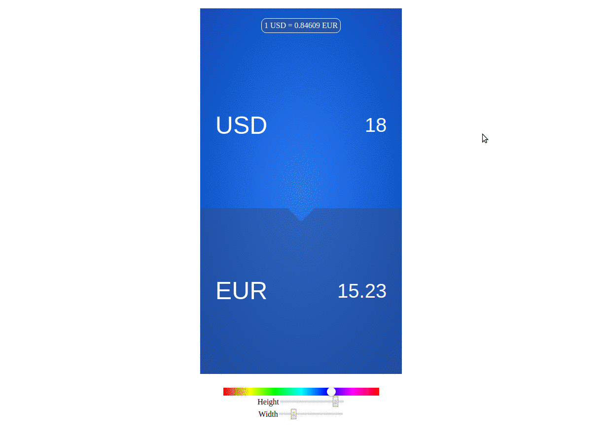

# react-exchange-widget

Customisable currency exchange React widget for [https://openexchangerates.org/](https://openexchangerates.org/)

Amazing [demo](https://dmitrymalakhov.github.io/react-exchange-widget/)



## Install

```bash
yarn add -D react-exchange-widget
```

or

```bash
npm install --save-dev react-exchange-widget
```

## Usage

```javascript
import React from 'react';
import ExchangeWidget from 'react-exchange-widget';

const serviceApiConfig = {
  appID: 'you-app-id-open-exchange-rates',
};

/../

render() {
  return (
    <div>
      <ExchangeWidget serviceApiConfig={serviceApiConfig} />
    </div>
  );
}

```

## Props

#### defaultPair: [string, string]

Initial currency pair

#### defaultValue: [number, number]

Initial value

#### serviceApiConfig: { appID: string }

Your AppID in https://openexchangerates.org/

#### syncAuto: boolean

Enable auto sync of currency rate

#### syncTimeout: number

Synchronization interval in milliseconds

#### theme: { background: string, width: string, height: string, textColor: string }

Object to configure a custom theme.